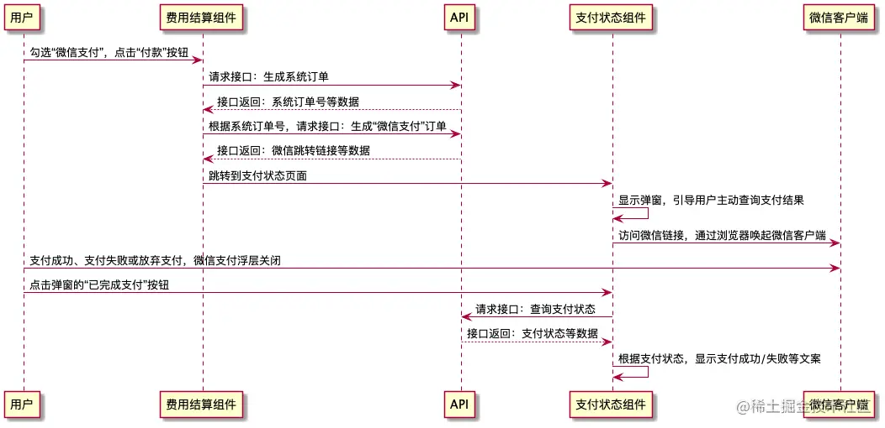

# 前言

> 整理微信h5、微信内、小程序、支付宝支付流程及差异、问题、解决方案
> 参考 [微信](https://blog.csdn.net/qq_42281321/article/details/124821562), [综合时序图等](https://juejin.cn/post/7024500631549247518)

## 微信

> 微信支付业务，针对小程序、微信浏览器和非微信浏览器中的网页的三种场景，我们可以分别通过官方提供的 小程序支付、JSAPI支付、H5支付来开发。

### 准备工作

1. 开通微信商户号、微信公众号然后按照步骤准备一堆资料审核
2. 设置相关配置(配置的步骤请查看官方文档)
3. 注意：配置`商户号的支付授权目录`和`公众号的授权域名`必须一致，不然会调起支付失败
4. 传送门
  - [微信内-JSAPI支付配置文档](https://pay.weixin.qq.com/wiki/doc/apiv3/open/pay/chapter2_1.shtml#part-6)
  - [微信外-H5支付配置文档](https://pay.weixin.qq.com/wiki/doc/apiv3/open/pay/chapter2_6_1.shtml)
  - [小程序支付](https://pay.weixin.qq.com/wiki/doc/apiv3/open/pay/chapter2_8_1.shtml)

### 微信外 - H5 支付

#### 开发流程

1. 请求创建订单接口拿到订单数据(`orderId`，订单号，支付金额)
2. 带`orderId`请求支付接口，获得 `mweb_url`
3. 跳转到微信支付中间页 `mweb_url` ，然后自动调用微信支付
4. 支付成功后跳转到配置的返回页（请求支付时携带的参数`redirectUrl`）

#### 注意事项

1. 商户号的支付授权目录和公众号的授权域名必须一致
2. 需对 `redirect_url` 进行 `urlencode` 处理（让后端处理吧🤭）
3. 调试需在线上环境（需要部署到公网服务器并映射到公众号配置的安全域名）
4. H5 支付只能在非微信浏览器中调起，`JSAPI` 支付是在微信浏览器环境调起的
5. 由于设置`redirect_url`后,回跳指定页面的操作可能发生在：
  > 1. 微信支付中间页调起微信收银台后超过5秒 
  > 2. 用户点击“取消支付“或支付完成后点“完成”按钮。
  > 因此无法保证页面回跳时，支付流程已结束，所以商户设置的redirect_url地址不能自动执行查单操作，应让用户去点击按钮触发查单操作。

### 微信内 - JSAPI 支付

#### 开发流程

1. 请求创建订单接口拿到订单数据(订单id，订单号，支付金额)
2. 通过微信网页授权，携带授权 code 重定向到订单支付页，并把订单数据拼接在重定向的地址后面（因为此步骤只适合history路由模式下，如果你项目是 hash 路由 建议此步骤看这篇[文章](https://cloud.tencent.com/developer/article/1921120)）
3. 到支付页后
  1. 获取地址栏上的 `code`、订单数据（`orderId`）
  2. 然后请求支付接口获得我们需要的数据（该数据保函了`wx.config`和`wx.chooseWXPay`两个方法需要的传参）
  3. 通过 `js-sdk` 提供的方法发起支付
    1. 先通过 `js-sdk` 提供的 `wx.config()` 注入权限验证配置
    2. 再通过 `wx.ready()` 接口处理成功验证
    3. 再通过 `wx.checkJsApi()` 判断客户端版本是否支持指定JS接口
    4. 再在 `wx.checkJsApi()` 里成功回调函数中调用 `wx.chooseWXPay()` 发起微信支付请求
4. 通过 `wx.chooseWXPay()` 支付成功回调：`success: function(res){}`，支付失败回调：`fail: function(err){}`，取消支付回调 `cancel: function(res){}`分别处理不同支付结果
5. [JS-SDK传送门](https://developers.weixin.qq.com/doc/offiaccount/OA_Web_Apps/JS-SDK.html)

### 微信内 - 小程序 支付

#### 开发流程

1. 请求创建订单接口，后端统一下单获取 orderId 并返回
2. 通过 wx.login() 获取 code
3. 携带 code 和 orderId 参数请求接口，获取支付所需数据
4. 获取支付所需数据之后，调 wx.requestPayment() 接口，调用起微信支付页面
5. 根据支付结果做相应操作
6. 参考 [小程序文档wx.login()](https://developers.weixin.qq.com/miniprogram/dev/api/open-api/login/wx.login.html),[小程序文档wx.requestPayment()](https://developers.weixin.qq.com/miniprogram/dev/api/payment/wx.requestPayment.html),[参考代码文章](https://juejin.cn/post/6896762413572767757#heading-0)

#### 注意事项

1. 申请微信小程序账号拿到的 AppID（小程序 id）和 AppSecret（小程序密钥）申请类型必须为企业性质，否则无法接入微信支付
2. 先要微信认证才能接入微信支付和绑定商户平台
3. 用第一步拿到的 AppID 来申请商户平台账号拿到 MchID（商户 id）和 MchKey（商户密钥）
4. 小程序关联商户号微信和商户都认证成功后，在微信后台微信支付菜单中进行关联接入微信支付
5. 在微信后台微信支付菜单中进行接入

## 支付宝

